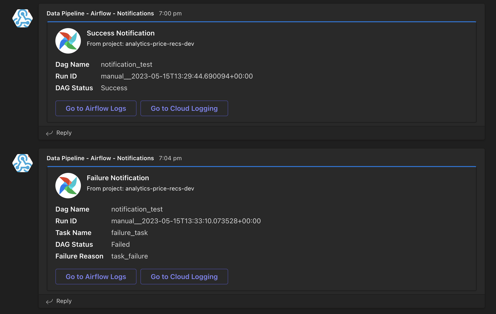

# <center>Teams Notification Utility

A common utility module to send alert notifications of the Airflow pipeline status during every DAG run to the given Teams Channel. This utility uses the Teams webhook connector which can be configured by following the steps as mentioned <a href="https://learn.microsoft.com/en-us/microsoftteams/platform/webhooks-and-connectors/how-to/add-incoming-webhook?tabs=dotnet#create-incoming-webhooks-1">here</a>. 

### Usage

* Set the Airflow Variables `webhook_url` and `project_id`.
> **webhook_url:** The Incoming Webhook's URL for the Teams Channel that receives the pipeline notification. \
> **project_id:** The GCP Project ID where the Cloud Composer's Environment and the DAG pipelines are created and running. 
* Import the `success_handler` and `failure_handler` from `util` module in the required Airflow DAG's pipeline module.
* Add the below callback functions in the pipeline's DAG object constructor.
```
on_success_callback=success_handler,
on_failure_callback=failure_handler
```    

### Features

Based on the DAG status, either a Success Notification or a Failure Notification is triggered for every run irrespective of their trigger type being manual or scheduled. 

In addition to DAG Name, Run ID, and DAG Statusk, the Failure Notification displays the Task Name, and Failure Reason as well.

Both the notification messages has a hyperlink button enabled which re-directs the user to the Airflow Logs of the final task or the GCP Cloud Logging's Logs Explorer to show the current DAGs complete logs.

### Notification Message

The Success and Failure Notification's teams message card looks like the below.


